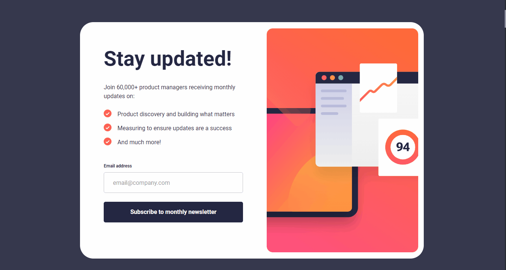

# Frontend Mentor - Newsletter sign-up form with success message solution

This is a solution to the [Newsletter sign-up form with success message challenge on Frontend Mentor](https://www.frontendmentor.io/challenges/newsletter-signup-form-with-success-message-3FC1AZbNrv). Frontend Mentor challenges help you improve your coding skills by building realistic projects.

## Table of contents

- [Overview](#overview)
  - [The challenge](#the-challenge)
  - [Links](#links)
- [My process](#my-process)
  - [Built with](#built-with)
  - [What I learned](#what-i-learned)
  - [Continued development](#continued-development)
- [Author](#author)

## Overview ✨

### The challenge 🎯

Users should be able to:

- Add their email and submit the form
- See a success message with their email after successfully submitting the form
- See form validation messages if:
  - The field is left empty
  - The email address is not formatted correctly
- View the optimal layout for the interface depending on their device's screen size
- See hover and focus states for all interactive elements on the page

### Links 🔗

- Solution: [Frontend Mentor](https://www.frontendmentor.io/solutions/newsletter-signup-built-with-react-tailwind-css-and-react-router-uJYj6sfZ83)
- Live Site: [Vercel](https://newsletter-sign-up-tawny.vercel.app/)

## My process 💻

### Built with 🛠️

- Semantic HTML5 markup
- CSS custom properties
- Mobile-first workflow
- [Vite](https://vitejs.dev/) - Initial Template React
- [React](https://pt-br.react.dev/) - JS library
- [React Router DOM](https://nextjs.org/) - React library
- [Tailwind CSS](https://tailwindcss.com/) - For styles

### What I learned 📚

With this project, I was able to significantly improve my CSS skills, including the use of Tailwind, a framework that proved extremely interesting for allowing the application of styles directly to HTML classes. In addition, I used the React Router library to define the project routes, learning how to work with states in React, which helped me become even more familiar with this technology in general.

### Continued development 🚀

I want to continue studying React and create amazing projects in the future. This is just the beginning; In the future, I plan to complete my portfolio using this amazing library!

## Author 🧑‍💻

- Frontend Mentor - [Fransuelton](https://www.frontendmentor.io/profile/Fransuelton)
- LinkedIn - [Fransuelton](https://www.linkedin.com/in/fransuelton/)
